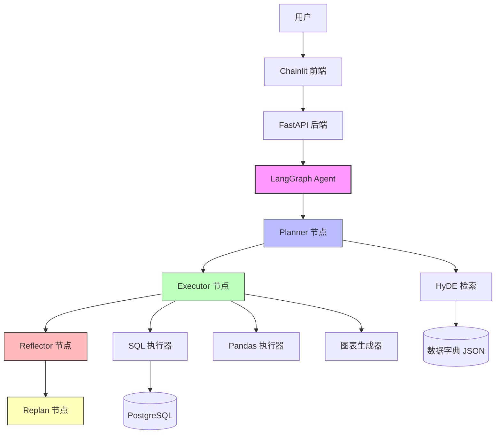
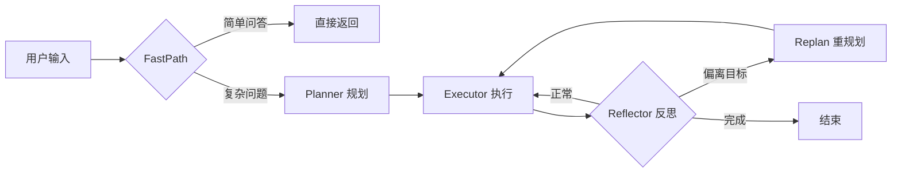

# Aurora-Insight

> 企业级自主数据分析与洞察多智能体系统

基于 LangGraph 的多智能体框架，实现了 **Plan-Execute-Reflect** 自主闭环，让 AI 像数据分析师一样思考、执行和自省。


## 🚀 核心功能

- **自适应规划器**：ReAct + Plan-and-Execute 混合，自动分解复杂任务
- **自我反思与重规划**：每3步自我审视，偏离目标时自动调整
- **安全沙盒执行器**：静态语法检查 + Mock试运行 + Fixer自愈（3次重试）
- **HyDE检索增强**：生成假想SQL，从数据字典中检索相关表结构
- **LLM-as-Judge验证器**：三规则校验（异常波动/格式/事实矛盾）
- **流式思维链输出**：实时展示推理过程
- **会话持久化**：支持多轮对话上下文
- **FastPath成本控制**：简单问题直连，降低90%费用
- **Chainlit前端界面**：交互式数据分析体验


## 🧠 系统架构



### 执行流程



### 四个核心节点

| 节点 | 职责 | 触发条件 |
|------|------|----------|
| **Planner** | 拆解用户问题，生成执行计划 | 每次任务开始 |
| **Executor** | 按计划执行工具调用（SQL/Pandas/图表） | 每个计划步骤 |
| **Reflector** | 评估执行质量，判断是否偏离目标 | 每3步触发 |
| **Replan** | 重新生成修正后的计划 | 检测到偏离时 |


## 🛠️ 技术栈

| 组件 | 技术 |
|------|------|
| 模型 | DeepSeek Chat |
| 编排 | LangGraph + LangChain |
| API | FastAPI + Uvicorn |
| 数据库 | PostgreSQL + SQLAlchemy |
| 数据分析 | Pandas + NumPy |
| 可视化 | Matplotlib |
| 前端 | Chainlit |


## 📁 项目结构

```
aurora-insight/
├── run.py                      # 启动入口
├── requirements.txt            # 依赖列表
├── .env.example                # 环境变量模板
├── README.md                   # 项目文档
├── src/
│   ├── agent/                  # Agent 核心
│   │   ├── agent.py            # 入口类（invoke）
│   │   ├── graph.py            # LangGraph 状态图
│   │   ├── nodes.py            # 4个核心节点
│   │   ├── state.py            # 状态定义
│   │   └── prompts.py          # 提示词模板
│   ├── tools/                  # 工具层
│   │   ├── sql_executor.py     # SQL 执行器
│   │   ├── pandas_executor.py  # Pandas 分析器
│   │   ├── plot_executor.py    # 图表生成器
│   │   ├── safe_executor.py    # 安全沙盒 + 自愈
│   │   ├── hyde_retriever.py   # HyDE 检索
│   │   ├── validator.py        # LLM-as-Judge
│   │   └── fastpath.py         # 快速通道
│   ├── models/                 # 模型层
│   │   └── client.py           # DeepSeek 客户端
│   ├── api/                    # API 层
│   │   └── app.py              # FastAPI 服务
│   └── chainlit_app.py         # Chainlit 前端
└── data/
    ├── dictionary.json         # 数据字典（HyDE 检索源）
    └── charts/                 # 图表输出目录
```


## 📦 快速启动

```bash
# 1. 克隆项目
git clone <your-repo-url>
cd aurora-insight

# 2. 创建虚拟环境
python -m venv venv
source venv/bin/activate          # Windows: venv\Scripts\activate

# 3. 安装依赖
pip install -r requirements.txt

# 4. 配置环境变量
cp .env.example .env
# 编辑 .env，填入 DEEPSEEK_API_KEY 和 PostgreSQL 连接信息

# 5. 启动后端
python run.py

# 6. 启动前端（新终端）
chainlit run src/chainlit_app.py -w --port 8001
```

### 访问服务

| 服务 | 地址 |
|------|------|
| API 文档 | http://localhost:8000/docs |
| Chainlit 界面 | http://localhost:8001 |
| 健康检查 | http://localhost:8000/health |


## 🔌 API 接口

### POST /invoke - 同步调用

```json
{
  "query": "分析各产品销量",
  "session_id": "optional-uuid"
}
```

```json
{
  "session_id": "uuid",
  "answer": "各产品销量为...",
  "metadata": {
    "steps": 3,
    "replans": 0,
    "reflections": 1
  }
}
```

### POST /stream - 流式输出（SSE）

```
data: {"type": "planning", "data": "📋 规划阶段"}
data: {"type": "planning_step", "data": "Step 1: 生成SQL"}
data: {"type": "executing", "data": "🔧 执行阶段"}
data: {"type": "executing_step", "data": "✅ SQL执行成功"}
data: {"type": "final", "data": "最终结果..."}
data: {"type": "end", "data": "✅ 完成", "duration": 3.2}
```


## 💬 示例对话

**用户：** "帮我分析一下各产品的销量和销售额"

**Agent：**

```
📋 规划阶段
  Step 1: 分析用户问题 → 识别为销量分析任务
  Step 2: 生成SQL → SELECT product, SUM(quantity)...
  Step 3: 执行查询 → 连接数据库
  Step 4: 生成结论 → 分析结果

🔧 执行阶段
  📝 生成SQL查询
  🔍 执行查询中...
  ✅ SQL执行成功，返回 4 行数据
  📝 生成Pandas分析代码
  🔍 执行分析中...
  ✅ Pandas分析完成
  ✅ 数据验证通过
  ✅ 最终回答已生成

🔍 反思阶段
  ✅ 反思结果: 正常 - 无

📊 最终结果
  销量方面，AirPods Pro以825件居首，iPhone 15售出540件，
  MacBook Pro售出345件，iPad Pro仅售55件。
  销售额上MacBook Pro最高（69万元），其次为iPhone 15（54万元）、
  AirPods Pro（16.5万元）和iPad Pro（11万元）。

✅ 完成 ⏱️ 23.39s
```


## ✨ 项目亮点

| 亮点 | 说明 |
|------|------|
| **自主闭环** | Plan-Execute-Reflect 全自动，无需人工介入 |
| **成本优化** | FastPath 拦截简单问题，预计降低 90% LLM 调用费用 |
| **安全自愈** | SQL/Python 沙盒执行 + 3次自动重试修复 |
| **可观测性** | SSE 流式输出，实时展示推理和执行过程 |
| **可扩展** | 工具层模块化，新增工具只需实现统一接口 |
| **检索增强** | HyDE 假想 SQL 检索，提升复杂问题表结构召回率 |


## ⚙️ 配置说明

### 环境变量 (.env)

```env
# DeepSeek API
DEEPSEEK_API_KEY=your_api_key

# PostgreSQL
POSTGRES_USER=your_user
POSTGRES_PASSWORD=your_password
POSTGRES_HOST=localhost
POSTGRES_PORT=5432
POSTGRES_DB=your_database
```

### 模型参数

| 任务类型 | Temperature | Max Tokens | 用途 |
|---------|-------------|------------|------|
| reasoning | 0.1 | 4096 | 规划、反思、推理 |
| code | 0.0 | 4096 | SQL/Pandas 代码生成 |
| fast | 0.1 | 512 | 快速问答 |
| creative | 0.7 | 4096 | 创意任务 |


## 🚧 后续优化方向

- [ ] 多轮对话数据复用：追问时直接使用上一轮结果，避免重复 SQL 查询
- [ ] 生产级持久化：PostgresSaver 替代 MemorySaver，支持服务重启恢复
- [ ] 测试覆盖：pytest 单元测试，保证核心模块质量
- [ ] 日志系统：logging 替代 print，支持日志分级和持久化


## 📄 License

MIT


## 👤 作者

庄晓婷 · [GitHub](https://github.com/xiaotingzhuang) · [邮箱](mailto:2318767822@qq.com)